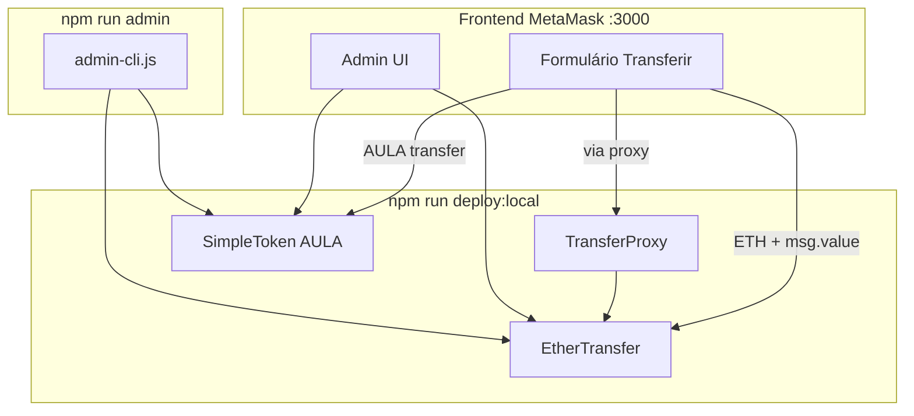
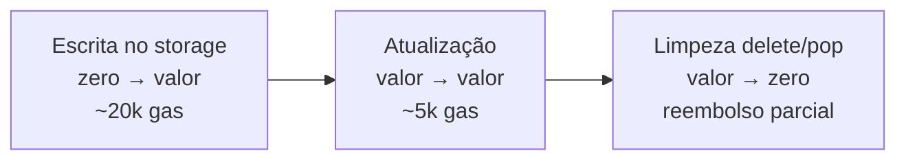
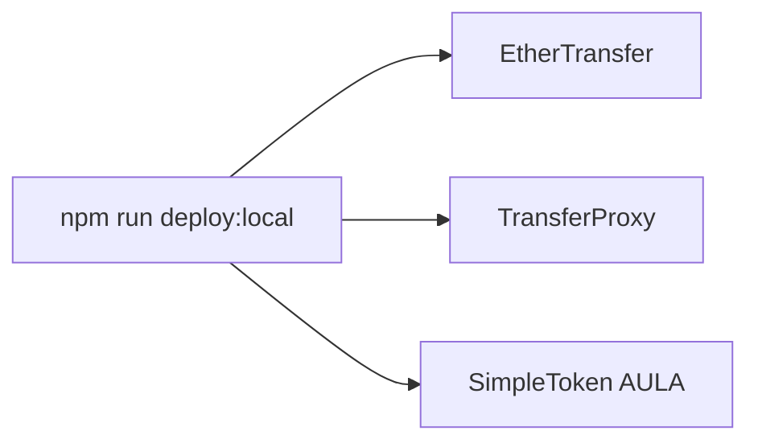
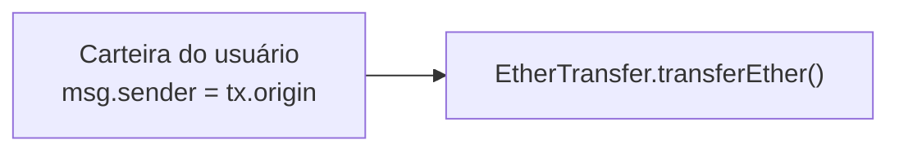
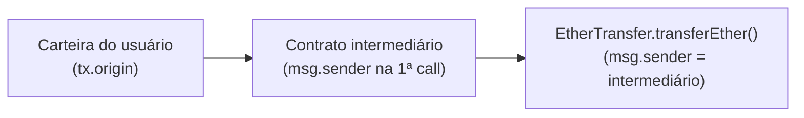

# Aula 3 — Ether Transfer Web3 + Token

Hardhat + smart contract `EtherTransfer` + `TransferProxy` + **`SimpleToken` (AULA)** + frontend MetaMask/ethers.js v5.

**Autor:** Leandro Melo de Sales — [leandro@ic.ufal.br](mailto:leandro@ic.ufal.br)

**Licença:** [MIT](LICENSE.md)

Este repositório é **auto-contido**: inclui transferência de ETH com taxa, logs, proxy, abas Admin/MetaMask, testes automatizados **e** um token ERC-20 próprio (`SimpleToken`) com distribuição via `mint`, transferência no frontend e administração on-chain. Evolução didática da [aula-2](../aula-2/README.md) (mesma base + token).

---

## Visão geral

### Objetivo didático

| Conceito | Onde aparece neste projeto |
| -------- | -------------------------- |
| Transferência nativa com taxa on-chain | `EtherTransfer.transferEther` |
| Contrato intermediário (`msg.sender` ≠ `tx.origin`) | `TransferProxy` |
| Token fungível (ERC-20 simplificado) | `SimpleToken` |
| Supply controlado pelo emissor | `mint` / `burnFrom` (owner) |
| Distribuição inicial zero | constructor do token sem `mint` automático |
| Dois ativos no mesmo dapp | seletor **ETH / AULA** no frontend |
| Cotação simbólica (não é DEX) | `weiPerToken`, `ethValueOf`, pré-visualização na UI |
| Testes automatizados | `npm test` (Hardhat + Chai) |

### Arquitetura



| Contrato | Arquivo | Papel |
| -------- | ------- | ----- |
| `EtherTransfer` | `contracts/EtherTransfer.sol` | Transferência de **ETH** com taxa 5%, histórico `transfersByOrigin`, admin on-chain |
| `TransferProxy` | `contracts/TransferProxy.sol` | Contrato intermediário que chama `transferEther` — demo `msg.sender` vs `tx.origin` |
| `SimpleToken` | `contracts/SimpleToken.sol` | Token **AULA** (ERC-20 didático), supply inicial **zero**, distribuição via `mint` |

---

## Funcionalidades

### Transferência com taxa (5%)

O contrato `EtherTransfer` expõe `transferEther(address payable to)`, função **payable**: o remetente envia ETH na mesma transação (`msg.value`).

No contrato, a taxa é calculada on-chain (`fee = msg.value * 5 / 100`); o destino recebe o líquido (`amount = msg.value - fee`) via `call{value: amount}`. A taxa permanece no saldo do contrato (consultável por `getContractBalance()`).

No frontend (`frontend/app.js`), o formulário chama:

```javascript
contract.transferEther(to, { value: ethers.utils.parseEther(amountEth) });
```

A MetaMask assina a transação; o valor digitado é o **total enviado** (`msg.value`), não o líquido. Após a confirmação, o app atualiza saldos e exibe o hash da transação com link para o block explorer (configurado no `.env` → `frontend/config.js`).

### Transferência com token (`SimpleToken` / AULA)

Além de ETH, o frontend permite transferir o token **`SimpleToken`** (símbolo **AULA**, 18 decimais). O contrato implementa um ERC-20 simplificado em `contracts/SimpleToken.sol`.

| Aspecto | ETH (`EtherTransfer`) | Token (`SimpleToken`) |
| ------- | --------------------- | --------------------- |
| Função | `transferEther` (payable) | `transfer(to, amount)` |
| Taxa on-chain | 5% retida no contrato | **Nenhuma** (só gas em ETH) |
| Supply inicial | N/A (ETH nativo) | **Zero** — ninguém recebe tokens no deploy |
| Distribuição | Usuário envia ETH da carteira | Owner **`mint`** via Admin ou CLI |
| Histórico na aba Logs | `TransferExecuted` | Não integrado (evento `Transfer` ERC-20) |

No formulário da aba **Transferir**, o usuário escolhe **Ethereum (ETH)** ou **Token (AULA)**. Em modo token, o app chama:

```javascript
tokenContract.transfer(to, ethers.utils.parseEther(amountTokens));
```

A cotação **`weiPerToken`** (quantos wei de ETH valem 1 token inteiro) é **referência para a UI** — pré-visualização e tooltip —, não um swap automático on-chain. Valor inicial no deploy: **1 AULA = 0,001 ETH** (`1e15` wei). O owner altera com `setEthRate`.

> **Importante:** após o deploy, **nenhuma carteira tem AULA** até o owner executar `mint`. Use a aba **Admin → SimpleToken** ou `npm run admin` para distribuir tokens antes de testar transferências.

### Contrato `SimpleToken` — referência completa

Implementação **didática** de ERC-20 (sem OpenZeppelin): `transfer`, `approve`, `transferFrom` e funções admin no mesmo arquivo.

#### Parâmetros fixos no deploy

| Campo | Valor |
| ----- | ----- |
| Nome | Aula Token |
| Símbolo | AULA |
| Decimais | 18 |
| Supply inicial | **0** |
| `weiPerToken` inicial | `1e15` wei → **1 AULA = 0,001 ETH** |
| Owner | quem executa `npm run deploy:local` (conta #0 do Hardhat, por padrão) |

#### Estado on-chain

| Variável | Descrição |
| -------- | --------- |
| `totalSupply` | Tokens em circulação |
| `balanceOf[addr]` | Saldo por carteira |
| `allowance[owner][spender]` | Aprovação para `transferFrom` |
| `weiPerToken` | Wei de ETH equivalentes a **1 token inteiro** (10¹⁸ unidades) |

#### Funções públicas (qualquer usuário)

| Função | Efeito |
| ------ | ------ |
| `transfer(to, amount)` | Move tokens do `msg.sender` para `to` |
| `approve(spender, amount)` | Define allowance |
| `transferFrom(from, to, amount)` | Move tokens com allowance |
| `burn(amount)` | Titular queima os próprios tokens |
| `ethValueOf(tokenAmount)` | View: converte quantidade de tokens em wei ETH pela cotação |

#### Funções administrativas (`onlyOwner`)

| Função | Efeito |
| ------ | ------ |
| `mint(to, amount)` | Cria tokens; emite `Mint` + `Transfer(0x0, to, amount)` |
| `burnFrom(from, amount)` | Queima tokens de `from`; reduz `totalSupply` |
| `setEthRate(newWeiPerToken)` | Atualiza cotação; emite `EthRateUpdated` |
| `transferOwnership(newOwner)` | Transfere owner do token |

#### Eventos

`Transfer`, `Approval`, `Mint`, `Burn`, `EthRateUpdated`, `OwnershipTransferred`.

> **Cotação:** `setEthRate` **não** converte ETH em AULA automaticamente. Serve para a UI exibir equivalente em ETH na pré-visualização e no tooltip do saldo.

### TransferProxy (`contracts/TransferProxy.sol`)

Contrato fino que recebe ETH via `proxyTransfer(to)` e chama `etherTransfer.transferEther{value}(to)` internamente.

- **`msg.sender`** visto pelo `EtherTransfer` = endereço do **proxy**
- **`tx.origin`** = carteira do usuário que assinou na MetaMask
- O histórico `transfersByOrigin` e o evento `TransferExecuted` usam **`tx.origin`** — a transferência via proxy continua na aba **Minhas transferências** do usuário

No frontend, o botão **Transferir via proxy** só aparece no modo **Ethereum (ETH)**.

### Captura de eventos de log (`TransferExecuted`)

Cada transferência bem-sucedida emite o evento `TransferExecuted(from, to, value, fee)` no contrato. O frontend registra esse histórico na aba **Logs**.

A captura funciona de duas formas complementares:

1. **Histórico on-chain** — `refreshLogs()` consulta a blockchain via `provider.getLogs` (filtrando pelo topic de `TransferExecuted`) e, como fallback, `queryFilter`. Os logs são decodificados com `contract.interface.parseLog` e renderizados na lista, com links para tx e endereços no explorer.
2. **Receipt da transação atual** — após `tx.wait()`, `ingestTransferExecutedFromReceipt()` lê os logs do receipt da transferência feita pelo app e inclui o evento na lista mesmo se a busca histórica ainda não tiver retornado.

Ao abrir a aba **Logs** ou clicar em **Atualizar logs**, o histórico é recarregado. Sem carteira conectada, a leitura usa um provider somente leitura apontando para `http://127.0.0.1:8545` (nó Hardhat local).

> **Importante:** o `CONTRACT_ADDRESS` em `.env` / `config.js` deve ser o contrato **deployado na rede atual**. Após reiniciar o nó Hardhat, rode `npm run deploy:local` de novo — um endereço antigo pode ter bytecode desatualizado e os eventos não batem com o ABI do frontend.

### Escuta ativa de eventos (`contract.on`)

Além da consulta pontual, o app registra um **listener** com ethers.js:

```javascript
contract.on('TransferExecuted', onTransferExecutedEvent);
```

Isso é escuta **reativa**: sempre que **qualquer cliente** chamar `transferEther` no mesmo contrato e na mesma rede — o frontend, `npm run admin` (opção transferEther), Hardhat console, etc. — o provider notifica o callback e a aba **Logs** é atualizada sem clicar em **Atualizar logs**.

O listener é configurado em `setupTransferLogsListener()`:

- **Com carteira conectada** — escuta via provider da MetaMask.
- **Sem carteira** — escuta via `JsonRpcProvider` local (polling HTTP no Hardhat).

A escuta só funciona com a **página aberta**. Ao desconectar a carteira, o listener volta para o modo somente leitura; ao fechar a aba, a escuta encerra.

Para testar eventos “externos” ao app, veja a seção [Simular evento externo ao frontend](#simular-evento-externo-ao-frontend-hardhat-console) abaixo.

### Histórico on-chain por carteira (`transfersByOrigin`)

Além do evento `TransferExecuted`, cada transferência bem-sucedida é gravada no storage do contrato:

```solidity
mapping(address => TransferRecord[]) public transfersByOrigin;
```

A chave é a **carteira que iniciou a transação** (`tx.origin`); o valor é um array com todas as `TransferRecord` (`from`, `to`, `value`, `fee`) atribuídas a ela. Consultas: `getTransfersByOrigin(wallet)` e `getTransferCountByOrigin(wallet)`.

Essa estrutura prepara a próxima atividade do frontend: uma aba **“Minhas transferências”**, em que o usuário conectado verá tudo o que **ele** disparou na MetaMask, mesmo que no futuro um contrato intermediário chame `transferEther` em nome dele.

> **Crescimento do storage:** cada `push` no array aumenta o estado persistido do contrato **para sempre**, até alguém apagar esses slots. Veja [Administração do contrato](#administração-do-contrato-modifiers-e-limpeza-de-storage).

### Administração do contrato (modifiers e limpeza de storage)

O mapping `transfersByOrigin` tende a **crescer sem limite**: não há `pop` automático nem expiração. Com o tempo, isso aumenta o **tamanho do estado** da rede e o **custo de gas** de futuras escritas naquele contrato.

Para mitigar isso, o contrato define um **dono** (`owner`, definido no `constructor` como quem fez o deploy) e funções **administrativas** que só ele pode chamar. Também há uma **flag global** `enabled` para suspender operações públicas sem redeploy.

#### Recursos Solidity: `modifier`

Um **modifier** é um trecho reutilizável que envolve a execução de uma função. Ele roda **antes** (e opcionalmente depois) do corpo da função; o `_;` indica onde o corpo original continua:

```solidity
modifier onlyOwner() {
    require(msg.sender == owner, "Apenas o dono do contrato");
    _;  // aqui executa transferEther, setEnabled, clear..., etc.
}
```

| Modifier | Aplicado em | Efeito |
| -------- | ----------- | ------ |
| **`onlyOwner`** | Funções administrativas | Só `owner` passa; demais revertem. |
| **`onlyEnabled`** | `transferEther` | Se `enabled == false`, transferências públicas ficam suspensas. |

**Por que usar modifier em vez de repetir `require`?** Evita duplicação, centraliza a regra de acesso e deixa explícito, na assinatura da função, quem pode chamá-la (`onlyOwner`, `onlyEnabled`).

#### Funções administrativas (`onlyOwner`)

| Função | Descrição |
| ------ | --------- |
| **`setEnabled(bool)`** | Liga (`true`) ou desliga (`false`) `transferEther`. Emite `OperationsStatusChanged`. |
| **`clearTransfersByOrigin(address)`** | Apaga **todo** o histórico on-chain de uma carteira (`delete` no array) e **remove** o endereço de `_walletsWithTransfers`. Emite `TransfersCleared`. |
| **`pruneTransfersByOrigin(address, keepLast)`** | Mantém só os **`keepLast`** registros **mais recentes**; remove os mais antigos (a carteira permanece no índice). Emite `TransfersPruned`. |
| **`clearAllTransfers()`** | Zera **todo** o `transfersByOrigin` e esvazia `_walletsWithTransfers`. Emite `AllTransfersCleared`. |
| **`getRegisteredWalletCount()`** | View: quantas carteiras estão no índice on-chain. |
| **`getRegisteredWallets()`** | View: lista de endereços com chave ativa em `transfersByOrigin` (espelho de `_walletsWithTransfers`). |
| **`withdrawFees` / `withdrawAllFees`** | Owner saca taxas acumuladas no saldo do contrato. Emite `FeesWithdrawn`. |
| **`transferOwnership` / `renounceOwnership`** | Transfere ou renuncia o papel de owner. Emite `OwnershipTransferred`. |
| **`setMaxRecordsPerWallet`** | Define limite de registros por carteira; FIFO remove os mais antigos ao exceder. |
| **`maxRecordsPerWallet`** | View: limite atual (padrão 50 no deploy). |

Estado público consultável: `owner`, `enabled`, `maxRecordsPerWallet`.

#### SimpleToken — funções administrativas (`onlyOwner`)

Contrato separado (`TOKEN_ADDRESS` no `.env`). O **owner** do token é quem faz o deploy (mesma conta #0 do Hardhat, por padrão).

| Função | Descrição |
| ------ | --------- |
| **`mint(to, amount)`** | Cria tokens e credita `to`; aumenta `totalSupply`. Emite `Mint` e `Transfer(address(0), to, amount)`. **Principal forma de distribuir** após o deploy. |
| **`burnFrom(from, amount)`** | Queima tokens de qualquer carteira; reduz `totalSupply`. |
| **`setEthRate(newWeiPerToken)`** | Atualiza cotação 1 AULA → X ETH. Emite `EthRateUpdated`. |
| **`transferOwnership(newOwner)`** | Transfere ownership do token. |

Funções públicas do titular: `transfer`, `approve`, `transferFrom`, `burn` (queima própria). View: `balanceOf`, `totalSupply`, `weiPerToken`, `ethValueOf(tokenAmount)`.

Eventos: `Transfer`, `Approval`, `Mint`, `Burn`, `EthRateUpdated`, `OwnershipTransferred`.

#### CLI administrativo (`npm run admin`)

Programa interativo em `scripts/admin-cli.js` para executar operações do **EtherTransfer** e do **SimpleToken** sem Hardhat console. Lê **`CONTRACT_ADDRESS`** e **`TOKEN_ADDRESS`** do `.env`; assina com a **conta #0 do `hardhat node`** (**`PRIVATE_KEY` opcional** — só se quiser outra carteira ou Sepolia).

O menu usa **[inquirer](https://www.npmjs.com/package/inquirer)** (`type: 'list'`): navegue com **↑ / ↓** e confirme com **Enter** — mesmo padrão do projeto api-tester.

**Pré-requisitos:** `npm run chain`, `npm run deploy:local` (owner = conta #0 por padrão).

```bash
npm run admin
```

Opções **EtherTransfer:** status (ETH + token), `setEnabled`, `clearTransfersByOrigin`, `pruneTransfersByOrigin`, `clearAllTransfers`.

Opções **SimpleToken:** `mint`, `burnFrom`, `setEthRate`, `tokenStatus` (supply, cotação, saldo de carteira).

| Menu CLI | Contrato | Ação |
| -------- | -------- | ---- |
| Status | Ambos | Owner, saldo ETH do contrato, supply AULA, cotação |
| setEnabled | EtherTransfer | Suspende/reativa `transferEther` |
| clear / prune / clearAll | EtherTransfer | Limpeza de `transfersByOrigin` |
| mint | SimpleToken | Distribui tokens para uma carteira |
| burnFrom | SimpleToken | Queima tokens de uma carteira |
| setEthRate | SimpleToken | Define 1 AULA = X ETH |
| tokenStatus | SimpleToken | Consulta supply, cotação e `balanceOf` |

**Exemplo no Hardhat console — EtherTransfer** (conta #0 = deployer = owner):

```javascript
const c = await ethers.getContractAt('EtherTransfer', '0x...');
await c.setEnabled(false);                    // suspende transferências
await c.setEnabled(true);                     // reativa
await c.clearTransfersByOrigin('0xAbc...');   // zera histórico da carteira
await c.pruneTransfersByOrigin('0xAbc...', 10); // mantém só os 10 últimos
await c.clearAllTransfers();                  // zera todo o storage de histórico
```

**Exemplo no Hardhat console — SimpleToken** (distribuir tokens):

```javascript
const tokenAddr = '0x...'; // TOKEN_ADDRESS do .env
const token = await ethers.getContractAt('SimpleToken', tokenAddr);
const [, alice] = await ethers.getSigners();
await token.mint(alice.address, ethers.parseEther('100')); // 100 AULA
await token.balanceOf(alice.address);
await token.setEthRate(ethers.parseEther('0.002')); // 1 AULA = 0,002 ETH
```

Para o dia a dia, prefira **`npm run admin`** (menu interativo com a mesma conta do `.env`).

#### Por que limpar o storage importa (reembolso de gas)

No Ethereum, **ler** storage custa gas; **gravar** custa bem mais. A primeira vez que um slot vai de **zero → valor não zero**, a operação `SSTORE` consome cerca de **20 000 gas** (slot “frio”). Alterar um slot já usado costuma menos (~**5 000 gas**, slot “quente”).

Quando você **apaga** dados on-chain (`delete`, `pop` até esvaziar, ou `delete` em um array/mapping), o slot volta para **zero**. A EVM concede um **reembolso de gas (gas refund)** a quem liberou aquele espaço — era uma forma de incentivar contratos a limparem estado que não usam mais.



**Como o reembolso funciona na prática**

1. Quem assina a tx de limpeza (**owner**) paga gas **na mesma transação** — o ETH sai da carteira dele uma única vez, no final, com base no gas **efetivamente cobrado**.
2. Ao zerar slots de storage, a EVM acumula um crédito interno de **gas refund** (por slot limpo).
3. No fechamento da tx, esse crédito **não é transferido** como ETH extra para a carteira. Ele **abaixa a conta de gas da própria tx**: você paga por menos gas do que consumiu “bruto”.
4. Desde a [EIP-3529](https://eips.ethereum.org/EIPS/eip-3529) (pós-London), o refund aplicável fica **limitado a no máximo 20 %** do gas usado naquela transação — mesmo que a limpeza “mereça” mais crédito teórico.

**O que você ganha de fato (e o que não ganha)**

| O que **não** acontece | O que **acontece** |
| ---------------------- | ------------------ |
| Nenhum ETH “bônus” cai na carteira do owner depois da tx. | A **fatura de gas da tx de limpeza fica mais barata** do que seria sem apagar storage. |
| Não é um crédito acumulável para txs futuras. | O estado on-chain **diminui** — nós guardam menos dados; leituras/escritas futuras podem ser mais baratas. |
| Limpar storage **não** apaga eventos antigos (`TransferExecuted` nos logs). | Você evita que o contrato cresça **sem controle**, o que em produção viraria custo permanente de estado. |

**Exemplo numérico (ilustrativo)**

Suponha gas price **30 gwei** e uma `clearAllTransfers` que:

- consome **200 000 gas** “bruto” na execução;
- zeraria slots que gerariam, em tese, **80 000 gas** de refund;
- mas a rede só aplica **20 %** de 200 000 → **40 000 gas** de desconto (teto).

```
Sem refund (hipotético):  200 000 × 30 gwei = 0,006 ETH debitados
Com refund (real):       (200 000 − 40 000) × 30 gwei = 0,0048 ETH debitados
Economia nesta tx:        0,0012 ETH — já refletida no débito único da MetaMask/ethers
```

Ou seja: o owner **paga menos ETH na mesma operação**; não recebe uma segunda transação de “reembolso”. A limpeza **ainda custa** (net positivo), só fica **menos cara** do que apagar o mesmo volume sem o mecanismo de refund — e o ganho estrutural principal é **liberar storage**, não lucrar com gas.

**Limitações didáticas**

- Eventos (`TransferExecuted`) **permanecem** no histórico da blockchain mesmo após `clear` no storage — logs não são apagados por essas funções.

#### O ideal em produção vs. este contrato (aula)

| Abordagem | Uso típico em produção | Neste projeto (didático) |
| --------- | ---------------------- | ------------------------ |
| **Eventos + indexador off-chain** | Histórico completo e buscas (The Graph, subsquid, backend) | Aba **Logs** / listener `contract.on` |
| **Pouco estado on-chain** | Só saldo, permissões, contadores — não listas infinitas | `transfersByOrigin` **on-chain** de propósito |
| **Teto por carteira** | `maxRecords` + FIFO; rejeita ou sobrescreve o mais antigo | Não implementado (exercício futuro) |
| **Limpeza em lotes** | Várias txs de `prune` (ex.: 100 registros por tx) | `prune` / `clear` por carteira |
| **`clearAll` em uma tx** | Raro; só com poucas carteiras/registros ou risco de estourar gas | Útil **localmente** com histórico pequeno |

**Faz sentido ter `clearAll` / “limpar milhares”?**

- **Como estratégia principal em produção, para histórico ilimitado: não.** O padrão real é **não depender** de arrays/mappings que crescem para sempre on-chain; o histórico “completo” fica nos **eventos** (baratos de emitir, indexados off-chain).
- **Como ferramenta admin pontual:** `clear` de **uma carteira** ou `prune` mantendo os últimos N — sim, isso é plausível.
- **`clearAllTransfers` numa única tx:** aceitável **na aula** (dezenas/centenas de registros, poucas carteiras). Com **milhares** de structs, a tx pode ultrapassar o **block gas limit** (~30M na mainnet) e **reverter** — daí a prática de **várias txs menores** ou nem guardar tudo on-chain.

**Resumo:** o “limpar tudo de uma vez” ensina modifiers, ownership e refund de storage; em produção o ideal é **limitar crescimento** (cap, pruning em lote) ou **mover histórico para off-chain**, usando on-chain só o mínimo necessário.

**Resumo técnico:** `onlyOwner` + `clear` / `prune` controlam o estado on-chain; o refund **desconta** parte do gas da tx de limpeza (até 20 %).

#### Deploy, owner e `PRIVATE_KEY`

O **owner** é quem faz o deploy.

| Comando | `PRIVATE_KEY` no `.env` |
| ------- | ------------------------ |
| **`npm run chain`** | **Sincroniza automaticamente** a chave da conta **#0** do nó no `.env` antes de subir o Hardhat (mesma derivacao das 20 contas exibidas no terminal). |
| **`npm run deploy:local`** | Usa `PRIVATE_KEY` do `.env` se valida; senao conta **#0** via Hardhat. Apos `npm run chain`, o `.env` ja traz a #0. |
| **`npm run admin`** | Mesma regra do deploy local. |
| **`npm run deploy:sepolia`** | **Obrigatoria** — carteira real com Sepolia ETH. |

O script `scripts/chain.js` grava a chave derivada com a mesma logica interna do Hardhat (`scripts/lib/hardhat-local-accounts.js`), para `deploy:local` e `admin` baterem com o owner exibido no nó.

Use **`PRIVATE_KEY` manual no `.env` apenas se** quiser outra carteira que nao a #0 no local (ex.: endereco da MetaMask no no) ou for para **Sepolia**. Cada `npm run chain` **sobrescreve** `PRIVATE_KEY` com a #0.

Após redeploy ou troca de carteira, rode **`npm run deploy:local` de novo** e confira no admin: **“Voce e o owner? sim”**.

O deploy local publica **`TransferProxy`** e **`SimpleToken`**, gravando `PROXY_ADDRESS` e **`TOKEN_ADDRESS`** no `.env` / `frontend/config.js`.



### Deploy (`scripts/deploy.js`)

Ordem de implantação na rede local (ou Sepolia):

1. `EtherTransfer.deploy()` → grava `CONTRACT_ADDRESS`
2. `TransferProxy.deploy(etherTransferAddress)` → grava `PROXY_ADDRESS`
3. `SimpleToken.deploy("Aula Token", "AULA")` → grava `TOKEN_ADDRESS`
4. Executa `npm run generate-config` → atualiza `frontend/config.js`

```bash
npm run chain          # terminal 1 — nó Hardhat + sync PRIVATE_KEY (#0)
npm run deploy:local   # terminal 2
```

Após **reiniciar** o nó Hardhat, endereços antigos deixam de existir — rode **`deploy:local` de novo** e recarregue o frontend.

## Frontend — recursos adicionais

| Recurso | Descrição |
| ------- | --------- |
| **Seletor ETH / AULA** | Radio buttons no formulário: transferência nativa ou token ERC-20. |
| **Saldo do token no header** | Chip **Token** com saldo AULA da carteira conectada (tooltip com cotação). |
| **Pré-visualização da taxa** | Modo ETH: total enviado, taxa 5% e líquido. Modo AULA: total em tokens + equivalente ETH (cotação). |
| **`callStatic` antes de enviar** | Simula `transferEther` ou `transfer` e exibe revert amigável via toast. |
| **`chainChanged`** | Ao trocar rede na MetaMask, sincroniza estado e tenta reconectar. |
| **Listener `OperationsStatusChanged`** | Banner e formulário reagem quando o owner suspende operações ETH (UI ou CLI). |
| **Logs / Minhas transferências** | Filtro por endereço destino e paginação (10 itens por página) — fluxo **ETH**. |
| **`TransferProxy` no formulário** | Botão *Transferir via proxy* — só modo ETH; oculto ao selecionar token. |
| **Saldo destino** | Card do endereço destino exibe ETH e, se deployado, saldo AULA. |
| **Badge de rede + health check** | Identifica Hardhat local / Sepolia; avisa se o contrato não existe na chain atual. |
| **Toasts** | Notificações no canto da tela substituem `alert()` (confirms destrutivos permanecem). |
| **Admin EtherTransfer** | Acordeões para saque de taxas, ownership, `maxRecordsPerWallet` e demais ações. |
| **Admin SimpleToken** | Acordeão **SimpleToken (AULA)**: `mint`, `burnFrom`, `setEthRate` + painel supply/cotação. |

Variáveis no `.env` / `generate-config`: `CONTRACT_ADDRESS`, `PROXY_ADDRESS`, **`TOKEN_ADDRESS`**, `SEPOLIA_CHAIN_ID`, `LOCAL_RPC_URL`, `BLOCK_EXPLORER_*`.

### Aba Transferir — seletor de ativo

| Modo | Contrato | Campo de valor | Botão principal | Proxy |
| ---- | -------- | -------------- | --------------- | ----- |
| **Ethereum (ETH)** | `EtherTransfer` | Valor (ETH) | Transferir | Visível |
| **Token (AULA)** | `SimpleToken` | Valor (AULA) | Transferir | Oculto |

Implementação em `frontend/app.js`: `getTransferAsset()`, `transferSubmit()` → `transferEther()` ou `transferToken()`.

### Aba Admin — acordeão SimpleToken (AULA)

Visível apenas se a carteira conectada for **`owner()`** do token (mesmo deployer, por padrão).

| Campo / botão na UI | Função on-chain |
| ------------------- | --------------- |
| Painel status | `name`, `symbol`, `totalSupply`, `weiPerToken`, `owner` |
| Distribuir tokens (mint) | `mint(to, amount)` |
| Queimar tokens (burnFrom) | `burnFrom(from, amount)` |
| Atualizar cotação | `setEthRate(parseEther(rateEth))` |

Demais acordeões Admin (`setEnabled`, histórico, taxas, ownership, `maxRecordsPerWallet`, `clearAllTransfers`) operam sobre **`EtherTransfer`**.

### Abas do frontend

| Aba | Conteúdo |
| --- | -------- |
| **Transferir** | Formulário ETH ou AULA; pré-visualização; proxy (ETH) |
| **Logs** | Eventos `TransferExecuted` (somente fluxo ETH) |
| **Minhas transferências** | `getTransfersByOrigin` da carteira conectada (ETH) |
| **Admin** | EtherTransfer + SimpleToken (owner) |

## Integração com a MetaMask (frontend)

O arquivo `frontend/app.js` centraliza a conexão com a carteira via [EIP-1193](https://eips.ethereum.org/EIPS/eip-1193) (`window.ethereum`). A MetaMask injeta o provider; o app usa **ethers.js v5** (`Web3Provider`, `getSigner`) para assinar transações e ler saldos.

### Conectar e desconectar

| Ação na UI | Método / comportamento |
| ---------- | ---------------------- |
| **Connect Wallet** | `eth_requestAccounts` — abre o popup da MetaMask se o site ainda não estiver autorizado. |
| **Disconnect** | `wallet_revokePermissions` (`eth_accounts`) + limpeza do estado local (provider, signer, contrato, abas dependentes, formulário). |

Após conectar com sucesso, a UI exibe endereço, chain ID, saldos (**ETH**, **AULA** e taxas no contrato), habilita o formulário de transferência (modos ETH e AULA) e atualiza abas **Minhas transferências** e **Admin** (esta última só se `owner()` de **EtherTransfer** coincidir com a carteira conectada — na prática, o mesmo deployer também é owner do token).

### Restauração de sessão após refresh da página

Se o usuário **já autorizou o site na MetaMask** e recarrega a página (F5), a app **não exige novo clique em Connect**:

1. Na inicialização, `tryRestoreWalletSession()` chama **`eth_accounts`** (sem popup — só retorna contas já autorizadas).
2. Se houver conta, `connectWallet({ silent: true })` recria provider, signer e contrato e repõe saldos, logs e abas como no fluxo manual.
3. Se a MetaMask injetar o provider **depois** do load da página, o evento **`ethereum#initialized`** dispara uma nova tentativa de restauração.

O botão **Connect** continua usando **`eth_requestAccounts`** (com popup) apenas quando o usuário conecta manualmente ou após desconexão explícita.

### Troca de conta na MetaMask (`accountsChanged`)

Enquanto a app está conectada, um listener **`accountsChanged`** observa a conta ativa na MetaMask:

| Situação | Comportamento |
| -------- | ------------- |
| Usuário **troca para outra conta** na MetaMask | A app **desconecta localmente** (`skipRevoke: true` — não revoga permissões do site). Em seguida, um **`confirm`** pergunta se deseja conectar à **nova** conta; se sim, chama `connectWallet()` de novo. |
| MetaMask fica **sem contas** (travamento / desconexão) | Apenas limpa o estado local; não exibe diálogo de reconexão. |
| Conta ativa **não mudou** | Nenhuma ação. |

Isso evita que a UI mostre o endereço antigo enquanto a MetaMask já usa outra conta — problema comum quando o `Web3Provider` não é recriado após a troca.

### Botão **MAX** (valor da transferência)

O comportamento depende do ativo selecionado:

**Modo Ethereum (ETH)** — ao lado do campo **Valor (ETH)**, o link **MAX** preenche o input com o **saldo máximo transferível**, reservando margem para **gas**:

1. **`contract.estimateGas.transferEther(to, { value, from })`** — simula a transação (usa o endereço destino se já preenchido; caso contrário, a própria carteira conectada).
2. **`provider.getFeeData()`** — obtém o preço atual (`maxFeePerGas` em redes EIP-1559 ou `gasPrice` em redes legadas, ex.: Hardhat local).
3. **Margem de +15%** sobre o `gasLimit` estimado, para absorver variação entre estimativa e execução real.
4. **Refinamento** — recalcula o gas com o valor já ajustado (`saldo − gas`), aproximando o máximo real.

**Fórmula:** `valor MAX ≈ saldo − (gasLimit × gasPrice × 1,15)`

Se o saldo não cobrir o gas estimado, a app alerta em vez de preencher um valor inválido. A transferência envia ETH da carteira via `value` na tx (`contract.transferEther(to, { value })`); por isso descontar gas evita falhas por “insufficient funds for gas * price + value”.

> **Nota:** a estimativa reflete rede e estado do contrato **no momento do clique**; o preço do gas pode mudar antes da confirmação na MetaMask.

**Modo Token (AULA)** — o **MAX** preenche com o **saldo integral de tokens** da carteira (`balanceOf`). O gas da transação continua sendo pago em ETH; não há taxa percentual no contrato do token.

Se o saldo AULA for zero, a app orienta a solicitar **`mint`** ao administrador.

### Fluxo geral da carteira

| Ação do usuário | Comportamento da app |
| --------------- | -------------------- |
| Clica **Connect Wallet** | Popup MetaMask → conecta e habilita UI completa |
| Clica **Disconnect** | Revoga permissões do site + limpa estado |
| Troca conta na MetaMask | Desconecta → pergunta → reconecta se aceitar |
| Refresh da página (site já autorizado) | Restaura sessão silenciosamente via `eth_accounts` |
| Clica **MAX** (ETH) | Preenche valor máximo menos gas estimado |
| Seleciona **Token (AULA)** | Formulário usa `SimpleToken.transfer`; proxy oculto |
| Clica **MAX** (AULA) | Preenche saldo total de tokens da carteira |

Listeners EIP-1193 são registrados em `initWalletProviderListeners()` (`accountsChanged` e, indiretamente, restauração via `ethereum#initialized`).

## `msg.sender` vs `tx.origin`

Duas variáveis globais do Solidity aparecem em quase todo contrato. Entender a diferença é essencial para segurança **e** para modelar corretamente “quem fez o quê” na interface.

### O que cada uma guarda

| Variável | Significado | Muda durante a tx? |
| -------- | ----------- | ------------------ |
| **`msg.sender`** | Conta que **chamou esta função agora** (carteira ou contrato). | Sim — a cada `call` na cadeia. |
| **`tx.origin`** | Conta que **assinou e enviou** a transação (sempre uma EOA no topo). | Não — fixo do início ao fim. |

### Fluxo direto (como hoje)



Nesse caso, **`msg.sender == tx.origin`**: os dois apontam para a mesma carteira.

### Fluxo com contrato no meio (cenário futuro)



Aqui **`msg.sender`** do `EtherTransfer` é o contrato intermediário; **`tx.origin`** continua sendo a carteira que clicou em “Confirmar” na MetaMask.

### Quando usar `msg.sender` (regra geral)

Use **`msg.sender`** quando a regra depende de **quem está na frente desta função agora**:

- **Controle de acesso** — “só o dono pode sacar”, “só quem chamou pode cancelar”.
- **Permissões e papéis** — owner, operador, aprovador.
- **Auditoria on-chain do caller imediato** — quem de fato executou esta chamada e enviou `msg.value` neste contexto.

É o padrão da indústria porque reflete a **pilha de chamadas** do Ethereum: cada função sabe exatamente quem a invocou.

### Por que **não** usar `tx.origin` para autenticação

`tx.origin` **não deve** substituir `msg.sender` em checagens do tipo “só o dono pode…”.

**Ataque clássico (phishing):**

1. O usuário assina uma transação que chama um **contrato malicioso**.
2. Esse contrato chama uma função sensível em outro contrato que usa `require(tx.origin == owner)`.
3. A checagem **passa**, porque `tx.origin` ainda é a carteira da vítima — mesmo com o contrato malicioso no meio.

Por isso a documentação do Solidity e guias de segurança recomendam:

> **Nunca use `tx.origin` para autenticação ou controle de acesso.**

Para permissões, **`msg.sender` é mais seguro**.

### Quando `tx.origin` faz sentido (com cuidado)

`tx.origin` é adequado quando o requisito é **“qual humano/carteira iniciou esta transação?”**, não “qual contrato chamou esta linha de código?”.

Exemplos:

- **Histórico de UX** — “minhas transferências”, independentemente de relayer ou contrato auxiliar no caminho.
- **Métricas off-chain ou analytics** — correlacionar eventos com a EOA que assinou.
- **Restrições fracas** — ex.: impedir que o *iniciador* seja um contrato (padrão controverso; use com parcimônia).

O ponto central: **`tx.origin` descreve quem assinou; `msg.sender` descreve quem chamou.** São perguntas diferentes.

### O que este projeto escolheu e por quê

| Aspecto | Escolha neste repositório |
| ------- | ------------------------- |
| **Storage `transfersByOrigin`** | Chave = **`tx.origin`** |
| **Campo `from` no struct / evento** | **`tx.origin`** |
| **Operação pública `transferEther`** | Qualquer carteira, se `enabled == true` |
| **Funções administrativas** | Apenas **`owner`** (`msg.sender == owner`) via modifier **`onlyOwner`** |
| **Pausa de operações** | Flag **`enabled`** + modifier **`onlyEnabled`** em `transferEther` |
| **Transferência AULA** | `SimpleToken.transfer` — **`msg.sender`** é o titular; sem taxa no token |
| **Supply AULA** | Zero no deploy; owner **`mint`** distribui |

**Motivo didático e de produto:** a próxima aba do frontend listará **todas as transferências iniciadas pela carteira conectada**. Se no futuro um contrato intermediário (batch, meta-transação, etc.) chamar `EtherTransfer`:

- Com **`msg.sender`** como chave, a transferência ficaria no histórico **do contrato**, não da carteira do usuário — sumiria da aba “Minhas transferências”.
- Com **`tx.origin`**, a transferência continua associada à **carteira que assinou na MetaMask**, que é o que o usuário espera ver.

**Trade-off consciente:** o histórico reflete “quem iniciou a tx”, não necessariamente “quem enviou o ETH nesta chamada” se a arquitetura mudar. Para este dapp educacional, priorizamos a visão do **usuário final**.

> **Resumo para a sala de aula:** use `msg.sender` para **permissões**; use `tx.origin` apenas quando a pergunta for **“quem assinou esta transação?”** — e documente o porquê, como neste README.

## Comandos npm

| Comando | Descrição |
| ------- | --------- |
| `npm run chain` | Sincroniza `PRIVATE_KEY` (#0) no `.env` e inicia o nó Hardhat local (`http://127.0.0.1:8545`, chain ID 31337). |
| `npm run compile` | Compila os contratos Solidity (`EtherTransfer`, `TransferProxy`, `SimpleToken`). |
| `npm run clean` | Remove cache e artefatos de compilação do Hardhat. |
| `npm test` | Roda testes Hardhat: `EtherTransfer`, `TransferProxy` e `SimpleToken`. |
| `npm run deploy:local` | Deploy na rede local dos **três** contratos; atualiza `CONTRACT_ADDRESS`, `PROXY_ADDRESS`, `TOKEN_ADDRESS` e regenera `frontend/config.js`. |
| `npm run deploy:sepolia` | Faz deploy na testnet Sepolia (requer `SEPOLIA_RPC_URL` e `PRIVATE_KEY` no `.env`). |
| `npm run generate-config` | Lê o `.env` da raiz e gera `frontend/config.js` (`window.APP_CONFIG`) para o browser. |
| `npm run frontend` | Regenera a config e sobe o servidor estático do frontend na porta 3000. |
| `npm run frontend:dev` | Regenera a config e sobe o frontend com recarregamento automático ao alterar arquivos ou o `.env`. |
| `npm run admin` | CLI interativo: operações admin do **EtherTransfer** e do **SimpleToken**, incluindo **transferEther** fora do frontend (teste da aba Logs). |

Deploy local grava `CONTRACT_ADDRESS`, `PROXY_ADDRESS` e **`TOKEN_ADDRESS`** no `.env`.

## Testes automatizados (`npm test`)

Suíte Hardhat + Chai em `test/`:

### EtherTransfer (`test/EtherTransfer.test.js`)

| Caso | O que valida |
| ---- | ------------ |
| Deploy | `owner`, `enabled`, `maxRecordsPerWallet` |
| `transferEther` | Líquido 95%, taxa 5%, registro em `transfersByOrigin` |
| Reverts | destino zero, valor zero |
| Modifiers | `onlyEnabled`, `onlyOwner` |
| Admin storage | `clear`, `prune`, FIFO, `withdrawAllFees`, `transferOwnership` |
| `TransferProxy` | Histórico em **`tx.origin`**, não no proxy |

### SimpleToken (`test/SimpleToken.test.js`)

| Caso | O que valida |
| ---- | ------------ |
| Deploy | Supply **zero**, cotação inicial 0,001 ETH/token |
| `mint` | Apenas owner; aumenta `totalSupply` e `balanceOf` |
| `transfer` | Move saldo entre carteiras |
| `burnFrom` | Reduz supply e saldo |
| `setEthRate` | Atualiza `weiPerToken` e `ethValueOf` |

```bash
npm test
```

Total: **16 testes** (11 EtherTransfer/Proxy + 5 SimpleToken).

## Simular evento externo ao frontend (Hardhat console)

Use isto para emitir `TransferExecuted` **sem passar pelo app** — por exemplo, para ver a aba **Logs** atualizar via escuta on-chain ou **Atualizar logs**.

**Pré-requisitos**

1. Nó local rodando: `npm run chain`
2. Contrato implantado: `npm run deploy:local` (atualiza `CONTRACT_ADDRESS` no `.env` e em `frontend/config.js`)
3. Frontend aberto (`npm run frontend` ou `npm run frontend:dev`) na mesma rede Hardhat (chain ID do `.env`)

**Passos**

Em outro terminal, na pasta **`aula-3`**:

```bash
npx hardhat console --network localhost
```

No console interativo, substitua o endereço pelo `CONTRACT_ADDRESS` do seu `.env`:

```javascript
const addr = '0x...'; // CONTRACT_ADDRESS do .env
const c = await ethers.getContractAt('EtherTransfer', addr);
const [, to] = await ethers.getSigners();
const tx = await c.transferEther(to.address, { value: ethers.parseEther('0.01') });
await tx.wait();
```

A transação chama `transferEther` on-chain e emite `TransferExecuted`. Com a página aberta, o listener (`contract.on`) deve incluir o evento na lista; caso contrário, clique em **Atualizar logs** na aba **Logs**.

**Alternativa no admin CLI**

```bash
npm run admin
```

Escolha **transferEther — tx fora do frontend (testar aba Logs)**. Por padrão usa a conta Hardhat #1 como destino e `0.05` ETH (ou `TRANSFER_AMOUNT_ETH` no `.env`, se definido). Equivalente ao fluxo acima, sem abrir o Hardhat console.

## Setup rápido

```bash
cp .env.example .env
npm install
npm run chain          # outro terminal
npm run deploy:local
npm test
npm run admin          # mint AULA para carteira de teste
npm run frontend
```

1. Conecte a MetaMask na rede Hardhat local.
2. Como **owner**, faça **mint** de tokens para a carteira conectada (Admin ou CLI).
3. Na aba **Transferir**, teste **Ethereum (ETH)** e **Token (AULA)**.

### Fluxo sugerido em sala de aula

1. **Deploy** — `npm run deploy:local`; mostrar `totalSupply()` do token = 0.
2. **Mint** — owner distribui 100 AULA para a conta #1 (MetaMask ou Hardhat).
3. **Transferir token** — UI em modo AULA; enviar 10 AULA para outro endereço.
4. **Transferir ETH** — modo Ethereum; `transferEther` com taxa 5%; conferir aba **Logs**.
5. **Proxy** — modo ETH + *Transferir via proxy*; verificar **Minhas transferências** (histórico em `tx.origin`).
6. **Cotação** — owner altera `setEthRate`; observar pré-visualização e tooltip do saldo AULA.
7. **Burn** — owner usa `burnFrom` na Admin ou CLI; conferir `totalSupply` reduzido.
8. **Testes** — `npm test` (16 casos).

---

## Variáveis de ambiente (`.env`)

Copie o template: `cp .env.example .env`

| Variável | Descrição |
| -------- | --------- |
| `PRIVATE_KEY` | Chave da conta deployer/admin; sincronizada por `npm run chain` (#0) |
| `LOCAL_RPC_URL` | RPC local (padrão `http://127.0.0.1:8545`) |
| `SEPOLIA_RPC_URL` | RPC Sepolia (deploy/testnet) |
| `CONTRACT_ADDRESS` | `EtherTransfer` — preenchido por `deploy:local` |
| `PROXY_ADDRESS` | `TransferProxy` — preenchido por `deploy:local` |
| `TOKEN_ADDRESS` | `SimpleToken` — preenchido por `deploy:local` |
| `HARDHAT_LOCAL_CHAIN_ID` | Chain ID do nó local (31337) |
| `SEPOLIA_CHAIN_ID` | Chain ID Sepolia (11155111) |
| `BLOCK_EXPLORER_ORIGIN` | Origem do explorer (links de tx/endereço) |
| `BLOCK_EXPLORER_TX_PATH` | Path da tx, ex.: `/tx/{txHash}` |
| `BLOCK_EXPLORER_ADDRESS_PATH` | Path de endereço, ex.: `/address/{address}` |

O script `scripts/generate-frontend-config.js` lê o `.env` e gera `frontend/config.js` (`window.APP_CONFIG`). Rode após cada deploy: `npm run generate-config` (automático em `deploy:local` e `frontend`).

---

## Estrutura do repositório

```
aula-3/
├── contracts/
│   ├── EtherTransfer.sol      # ETH + taxa 5% + admin + histórico
│   ├── TransferProxy.sol      # proxy → transferEther
│   └── SimpleToken.sol        # token AULA (ERC-20 didático)
├── scripts/
│   ├── deploy.js              # deploy dos 3 contratos + generate-config
│   ├── admin-cli.js           # menu admin ETH + token + transfer externo
│   ├── chain.js               # sobe nó + sync PRIVATE_KEY
│   ├── generate-frontend-config.js
│   └── lib/                   # env-wallet, env-file, hardhat-local-accounts
├── frontend/
│   ├── app.js                 # MetaMask, ETH/AULA, Admin, logs
│   ├── index.html
│   ├── styles.css
│   ├── config.js              # gerado — não editar manualmente
│   └── vendor/ethers.umd.min.js
├── test/
│   ├── EtherTransfer.test.js
│   └── SimpleToken.test.js
├── hardhat.config.js
├── package.json
├── .env.example
└── README.md
```

---

## Diferenças em relação à aula-2

| Aspecto | aula-2 | aula-3 (este repo) |
| ------- | ------ | ------------------ |
| Contratos | EtherTransfer + TransferProxy | + **SimpleToken** |
| Deploy | 2 contratos | **3 contratos** + `TOKEN_ADDRESS` |
| Frontend — transferência | Só ETH | **ETH ou AULA** |
| Header | Contrato + Carteira | + chip **Token** |
| Admin UI | Só EtherTransfer | + acordeão **SimpleToken** |
| `npm run admin` | Só ETH | ETH + **mint / burn / cotação** |
| Testes | EtherTransfer + Proxy | + **SimpleToken** |
| Supply AULA | — | **Zero** até `mint` |
